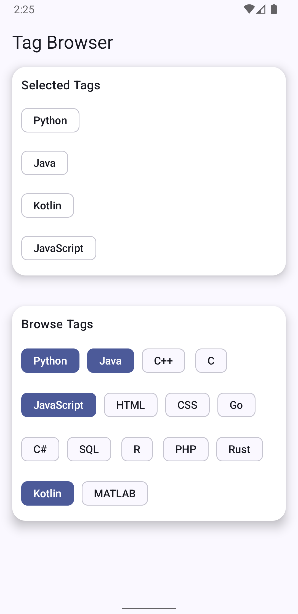

# CS501 HW3 Q3 — Tag Browser (FlowRow / FlowColumn)

A Jetpack Compose screen for browsing and selecting tags using **wrapping chips**.

- **Browse Tags:** a `FlowRow` of `FilterChip`s that automatically wraps to the next line.
- **Selected Tags:** a separate area that updates in real time as you tap chips.
- **Selected layout:** uses `FlowColumn` to stack selected chips into multiple columns when needed.

---

## Screenshot

---

## Features / Requirements Checklist

### Layout
- Uses **FlowRow** for a dynamic list of tags (chips) that wrap across the screen.
- Includes a second section using **FlowColumn** for a different purpose (selected tags arranged into columns).
- Includes a **Selected Tags** area that updates as the user taps chips (simple state).

### Material 3 components
- Uses **FilterChip** (browse tags) ✅
- Uses additional Material 3 components ✅
  - `Scaffold`
  - `Card`
  - `AssistChip`
  - `Divider`
  - `Text`
  - `MaterialTheme` (typography/colors)

### Modifiers & styling
- Consistent spacing with `Arrangement.spacedBy(...)`
- Responsive sizing with `fillMaxWidth()` and `padding(...)`
- Clear **selected state** through chip color changes (selected container/label colors)
- Cards styled as **white with drop shadows** for a polished look

---

## How it works

- The app stores selected tags in a `mutableStateListOf<String>()`.
- Tapping a tag in **Browse Tags** adds/removes it from the selected list.
- The **Selected Tags** section automatically recomposes to reflect the current selection.

---

## AI Disclosure

Parts of this project (including UI structure, Compose layout logic, and README text) were created with assistance from an AI tool (ChatGPT). All code was reviewed, edited, and tested by the student, and final implementation decisions were made by the student.
